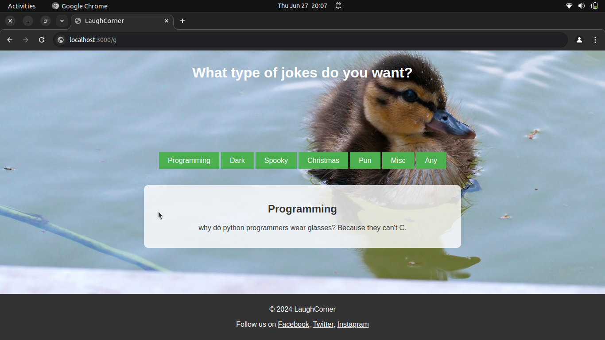

# LaughCorner

An open source dynamic and colorful joke site built with Express, EJS, and Bootstrap. This project allows users to fetch jokes from various categories with a modern UI inspired by humor and laughter.

## Features

- Fetch jokes from different categories like Programming, Dark, Spooky, Christmas, Pun, Misc, and Any.
- Responsive design using Bootstrap.

## Screenshots


<br><br><br><br><br><br>

## Installation

1. Clone the repository:
    ```sh
    git clone https://github.com/kailashnirola/LaughCorner.git
    ```
2. Navigate to the project directory:
    ```sh
    cd LaughCorner
    ```

3. Install the dependencies:
    ```sh
    npm install
    ```

## Usage

1. Start the server:
    ```sh
    npm start
    ```

2. Open your browser and go to `http://localhost:3000` to view the site.

## Technologies Used

- [Express](https://expressjs.com/) - Web framework for Node.js
- [EJS](https://ejs.co/) - Embedded JavaScript templates
- [Bootstrap](https://getbootstrap.com/) - CSS framework for responsive design
- [Axios](https://axios-http.com/) - Promise-based HTTP client for the browser and Node.js

## Contributing

Contributions are welcome! Please fork the repository and submit a pull request.

## License

This project is licensed under the MIT License. See the [LICENSE](LICENSE) file for details.

## Contact

For any questions or suggestions, please contact me at [b220017@nitsikkim.ac.in](mailto:b220017@nitsikkim.ac.in).

## Follow Us

- [Facebook](https://facebook.com)
- [Twitter](https://twitter.com)
- [Instagram](https://instagram.com)
